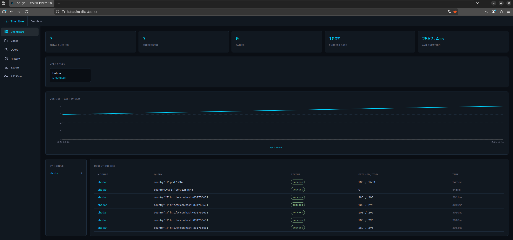
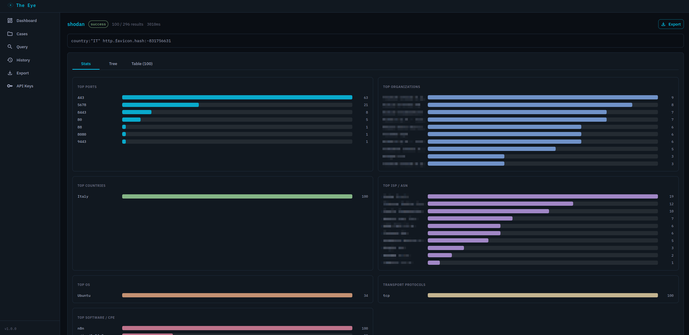
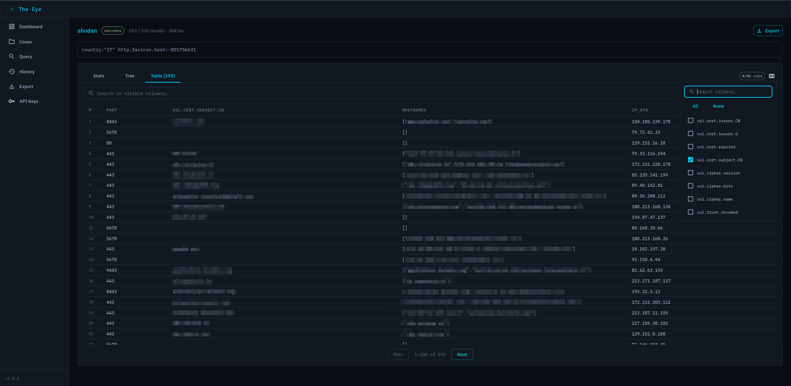
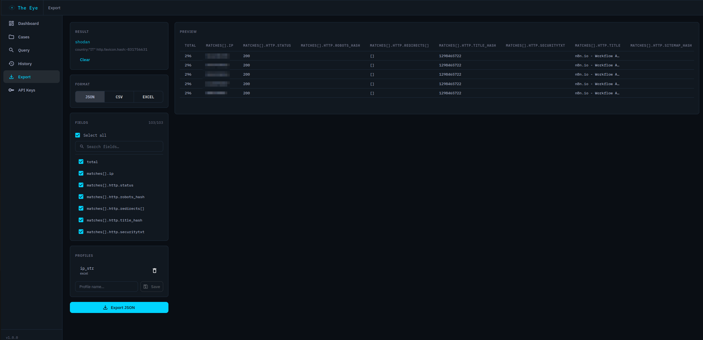
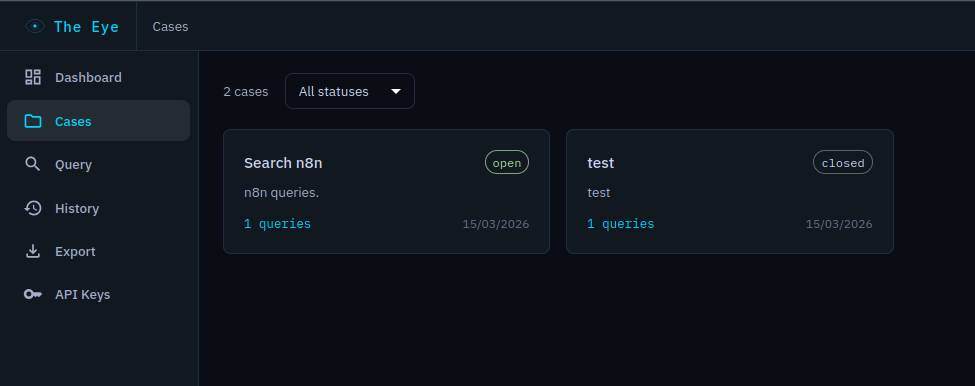
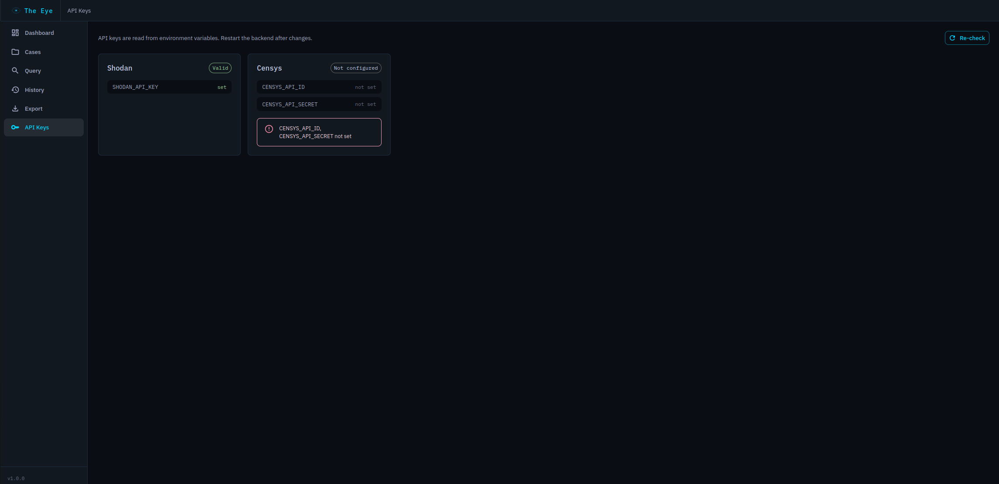

<p align="center">
  
</p>

<h1 align="center">The Eye</h1>

<p align="center">
  Modular OSINT platform for querying, analyzing, and exporting intelligence data.
  <br/>
  <strong>Shodan</strong> &middot; <strong>Censys</strong> &middot; <em>extensible</em>
</p>

---

## Screenshots

| Dashboard | Query Results — Stats |
|---|---|
|  |  |

| Data Explorer — Table | Export Engine |
|---|---|
|  |  |

| Case Management | API Keys |
|---|---|
|  |  |

---

## Features

- **Modular OSINT engine** — Shodan and Censys built-in, add new modules with a single file
- **Case management** — organize queries into investigation cases, add notes, export/import as ZIP
- **Stats overview** — automatic top-N analysis (ports, orgs, countries, ISP, OS, software/CPE)
- **Data explorer** — tree view + paginated table with column picker, search, and highlighting
- **Export engine** — JSON, CSV, Excel with selectable fields, saveable profiles, and live preview
- **API key validation** — check configured keys status directly from the UI
- **Dark OSINT theme** — IBM Plex fonts, cyan accents, designed for long investigation sessions

---

## Quick Start

### 1. Clone and configure

```bash
git clone git@github.com:FreeDurok/The-Eye.git
cd The-Eye
cp .env.example .env
```

Edit `.env` and add your API keys:

```env
DB_PASSWORD=changeme_in_production

# https://account.shodan.io
SHODAN_API_KEY=your_key_here

# https://search.censys.io/account/api
CENSYS_API_ID=your_id_here
CENSYS_API_SECRET=your_secret_here
```

### 2. Start

```bash
docker compose up --build -d
```

Three services will start:
- **Frontend** → [http://localhost:5173](http://localhost:5173)
- **Backend API** → [http://localhost:8000](http://localhost:8000)
- **API Docs** → [http://localhost:8000/docs](http://localhost:8000/docs)

### 3. Stop

```bash
docker compose down      # keep data
docker compose down -v   # destroy data (DB + query results)
```

---

## Architecture

```
┌─────────────┐     ┌──────────────┐     ┌──────────────┐
│  Frontend   │────▶│   Backend    │────▶│  PostgreSQL   │
│  React/Vite │     │   FastAPI    │     │              │
│  :5173      │     │   :8000      │     │  :5432       │
└─────────────┘     └──────┬───────┘     └──────────────┘
                           │
                    ┌──────┴───────┐
                    │   Modules    │
                    │  ┌─────────┐ │
                    │  │ Shodan  │ │
                    │  ├─────────┤ │
                    │  │ Censys  │ │
                    │  ├─────────┤ │
                    │  │  ...    │ │
                    │  └─────────┘ │
                    └──────────────┘
```

| Layer | Stack |
|---|---|
| Frontend | React 18, Vite, MUI, Zustand, Recharts |
| Backend | Python 3.12, FastAPI, SQLAlchemy (async), httpx |
| Database | PostgreSQL 16 |
| Storage | Query results on filesystem (not in DB) |

---

## Adding a New Module

Create a single file `backend/app/modules/<name>/module.py`:

```python
from app.modules.base import OsintModule, ModuleInfo, QueryResult

class MyModule(OsintModule):
    def get_info(self) -> ModuleInfo:
        return ModuleInfo(
            name="mymodule",
            display_name="My Module",
            description="...",
            required_keys=["MY_API_KEY"],
        )

    async def validate_keys(self) -> tuple[bool, str | None]:
        # Check if the API key works
        ...

    async def run_query(self, query, options=None) -> QueryResult:
        # Execute the query
        ...
```

Then register it in `backend/app/modules/__init__.py`:

```python
from app.modules.mymodule.module import MyModule

_REGISTRY = [
    ShodanModule(),
    CensysModule(),
    MyModule(),       # ← add this line
]
```

Add the API key to `backend/app/config.py` and `.env.example`. **No frontend changes needed** — the module appears automatically.

---

## Project Structure

```
The-Eye/
├── docker-compose.yml
├── .env.example
│
├── backend/
│   ├── Dockerfile
│   ├── requirements.txt
│   └── app/
│       ├── main.py              # FastAPI app
│       ├── config.py            # Settings from .env
│       ├── database.py          # Async PostgreSQL
│       ├── models/              # SQLAlchemy ORM
│       ├── schemas/             # Pydantic validation
│       ├── routers/             # API endpoints
│       ├── services/            # Business logic
│       └── modules/             # OSINT plugin system
│           ├── base.py          # OsintModule ABC
│           ├── shodan/
│           └── censys/
│
├── frontend/
│   ├── Dockerfile
│   ├── package.json
│   └── src/
│       ├── App.jsx
│       ├── theme.js             # MUI dark theme
│       ├── api/                 # Backend API client
│       ├── pages/               # Route pages
│       ├── components/
│       │   ├── layout/          # Sidebar, TopBar
│       │   └── explorer/        # DataExplorer, Stats, TreeNode
│       ├── hooks/               # useAsyncData
│       └── store/               # Zustand state
│
└── docs/
    ├── logo.svg
    └── screenshots/
```

---

## License

MIT
